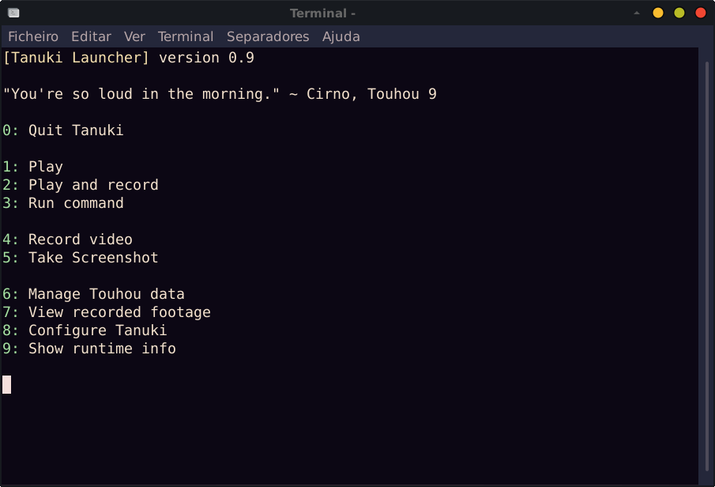

# Tanuki Launcher

<p align="center">

</p>

Tanuki Launcher is a cross-platform launcher for the Touhou Project games. It supports all games from Touhou 6 onwards. Tanuki can also be used to launch any game, not just Touhou games, and it has features worthy of a WINE helper.

<p align="center">

</p>

Tanuki has many extra features, such as screen and audio recording, Touhou scorefile backup, viewing and compressing screenshots, etc.

# Download

Download the latest instance of Tanuki in the [releases page](https://github.com/spacebanana420/tanuki/releases)

If you have Scala 3 in your system, download ```tanuki.jar```

If you just have Java in your system, download ```tanuki-java.jar```

If you are running an x86_64 Linux system, download ```tanuki-linux-x86_64.zip```

# Requirements & how to use

Tanuki requires the following to work:
* Scala 3 or Java 11 or later (unless running the native Linux binary)
* FFmpeg (optional, for screen recording, video playback and screenshot functionality)
* FFplay (optional, for viewing video and images)
  * FFplay comes with FFmpeg for most platforms

Tanuki's OS support extends to all operating systems with WINE support + Windows.

[More information on platform support here](doc/platforms.md)

# Configuration

[Full configuration information](doc/config.md)

To play games and manage your data, you need to add game and data entries to your ```config.txt```, which is automatically created where the jar is.

You can configure this file from within the launcher, or you can manually write your config text file.

The configuration also supports settings for command execution, etc.

### Config example:

```
wine=wine

game=Touhou 7:/path/to/touhou 7/th7.exe
data=Touhou 7 Data:/path/to/touhou 7
```

# Screen recording

[Recorder documentation](doc/recorder.md)

With FFmpeg, Tanuki can record your screen and audio as you play Touhou, to record your gameplay. You can configure the recording settings for a more faithful or lossless video footage, or for a more lightweight footage, whether it's lightweight as in low CPU usage or as in low file size.

After you record your footage, you can view it as many times as you want with [Gensokyo Cinema](doc/movie.md).

# Compile from source

You need [Scala 3](https://scala-lang.org/) to build Tanuki from source. You can use the scalac compiler or scala-cli.

You can compile Tanuki directly with scalac this way:

```
scalac src/*.scala src/*/*.scala src/*/*/*.scala -d tanuki.jar
```
This JAR can be launched with scala or scala-cli

For more information and alternatives on compiling Tanuki, check the link below.

[Compiling Tanuki from source](doc/compile.md)

<p align="center">

</p>
