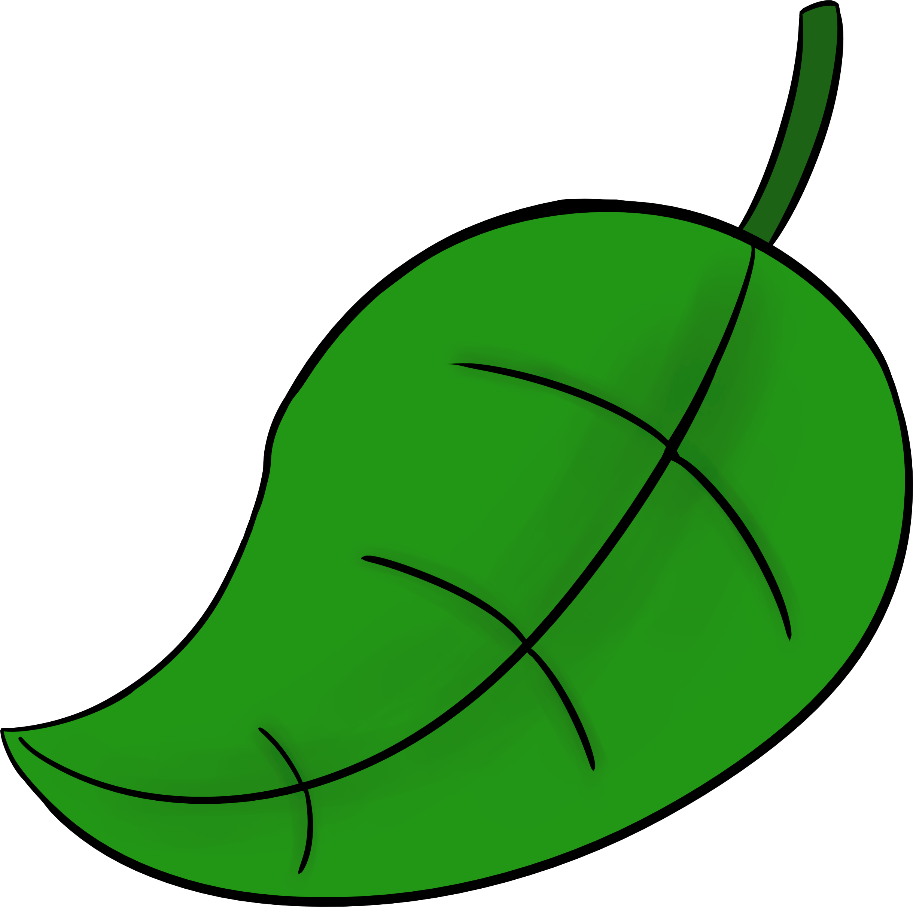
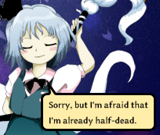

# Tanuki Launcher

<p align="center">

</p>

Tanuki Launcher is a cross-platform launcher for the Touhou Project games. It supports all games from Touhou 6 onwards.

The launcher uses a TUI interface and is very simple to use and configure. You can add your games and game data (screenshots, etc) to your configuration list. It's very convenient to launch a game once your configuration is done.

You can also view screenshots and compress them into PNG copies.

I plan to add screenshot cropping, data backup and more to Tanuki!

# Download

Download the latest instance of Tanuki in the [releases page](https://github.com/spacebanana420/tanuki/releases)

If you have Scala 3 in your system, download ```tanuki.jar```

If you just have Java in your system, download ```tanuki-java.jar```

# Requirements & how to use

Tanuki requires the following to work:
* Scala 3 or Java 8 or later
* FFmpeg (optional, for screen recording and screenshot functionality)

Tanuki's OS support extends to all operating systems with WINE support + Windows.

[More information on platform support here](doc/platforms.md)

# Configuration

[Full configuration information](doc/config.md)

To play games and manage your data, you need to add game and data entries to your ```config.txt```, which is automatically created where the jar is.

You can configure this file from within the launcher, or you can manually write your config text file.

### Config example:

```
command=wine

game=Touhou 7:/path/to/touhou 7/th7.exe
data=Touhou 7 Data:/path/to/touhou 7
```

## Running on Linux, MacOS, FreeBSD, etc

Tanuki is cross-platform, but the Touhou games are only distributed for x86 Windows. If you are not running Windows, you can run Touhou with WINE.

To run your Touhou games with WINE, add the following setting to your config.txt:
```
command=wine
```

I personally recommend you download and use Wine-GE instead, as it has better audio resampling (SFX won't be muffled in-game) and it uses fshack by default, which prevents the game's resolution from affecting your desktop's.

If you download a custom WINE build, assuming the path to your custom wine build is "/path/to/custom-wine/bin/wine", you can add to your config.txt:
```
command=/path/to/custom-wine/bin/wine
```

Due to typical dynamic-linking, to run a custom WINE build on NixOS, install ```steam-run``` on your system and add the following setting to your config.txt:
```
use_steam-run=true
```

# Screen recording

[Recorder documentation](doc/recorder.md)

With FFmpeg, Tanuki can record your screen and audio as you play Touhou, to record your gameplay. You can configure the recording settings for a more faithful or lossless video footage, or for a more lightweight footage, whether it's lightweight as in low CPU usage or as in low file size.


# Compile from source

You need [Scala 3](https://scala-lang.org/) to build Tanuki from source. You can use the scalac compiler or scala-cli.

You can compile Tanuki directly with scalac this way:

```
scalac src/*.scala src/*/*.scala src/*/*/*.scala -d tanuki.jar
```
This JAR can be launched with scala or scala-cli

For more information and alternatives on compiling Tanuki, check the link below.

[Compiling Tanuki from source](doc/compile.md)

<p align="center">

</p>
