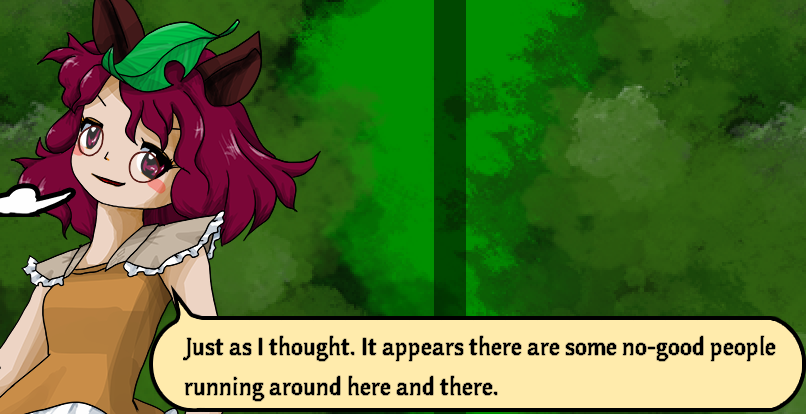

# Tanuki Configuration

To play games and manage your data, you need to add game and data entries to your ```config.txt```, which is automatically created where the jar is.

You can configure this file from within the launcher, or you can manually write your config text file.

Lines in the config file that start with "#" or don't start with an entry option are ignored.

### Supported options:

* ```game``` - Add a Touhou game entry.
  * The path must lead to a file.
* ```data``` - Add a data entry, for where your screenshots, replays, scorefiles, etc are.
  * The path must lead to a directory.
* ```command``` - Add a command entry to use a program to launch the games with.
  * The command does not support multiplte CLI arguments, it's just the program's name or the path to it.
  * Only 1 command is supported and is used for all game entries.
* ```sidecommand_start``` - Command that runs before launching a game.
* ```sidecommand_close``` - Command that runs after returning to main menu in the game screen.
* ```use_steam-run``` - Enables steam-run support. If you are not a NixOS user, ignore this option.
  * The package "steam-run" must be installed in your system.

The ```game``` and ```data``` entries require a name and a path, separated by ```:```. The order of the entries does not matter.

Tanuki only assumes the first instances of ```command```, ```sidecommand_start```, ```sidecommand_close``` and ```use_steam-run```. There's no need to write multiple entries of these options in the config.

```sidecommand_start``` and ```sidecommand_close``` run in parallel to game execution and closure and are not whitespace-safe, but you can pass CLI arguments to them and so build a full command.

### Config example:

```
command=wine

game=Touhou 7:/path/to/touhou 7/th7.exe
data=Touhou 7 Data:/path/to/touhou 7
```

The ```game``` and ```data``` entries require a name and a path, separated by ```:```. The order of the entries does not matter.

## Running on Linux, MacOS, FreeBSD, etc

Tanuki is cross-platform, but the Touhou games are only distributed for x86 Windows. If you are not running Windows, you can run Touhou with WINE.

To run your Touhou games with WINE, add the following setting to your config.txt:
```
command=wine
```
This setting will make Tanuki run your games with your system's wine. Note that it must then be installed. You can also add a custom wine fork that you downloaded by specifying the path to it.

I personally recommend you download and use Wine-GE instead, as it has better audio resampling (SFX won't be muffled in-game) and it uses fshack by default, which prevents the game's resolution from affecting your desktop's.

If you download a custom WINE build, assuming the path to your custom wine build is "/path/to/custom-wine/bin/wine", you can add to your config.txt:
```
command=/path/to/custom-wine/bin/wine
```

## Running on NixOS

Custom WINE builds are linked against glibc and other libraries that are located in common Linux paths. NixOS, however, does not use these traditional paths, making these binaries incompatible by default.

To run a custom WINE build on NixOS, install ```steam-run``` on your system and add the following setting to your config.txt:
```
use_steam-run=true
```

## Bad input delay with Xfce and other desktops

It seems that the Xfce desktop does not disable or bypass its compositor and desktop vsync when a fullscreen game is launched. It lets you, however, manually disable it, either through the GUI settings or through a command.

With this following configuration, Xfce's compositor will disable when you start a Touhou game and re-enable once you come back to the main menu:

```
sidecommand_start=xfconf-query -c xfwm4 -p /general/use_compositing -s false
sidecommand_close=xfconf-query -c xfwm4 -p /general/use_compositing -s true
```

<p align="center">

</p>
