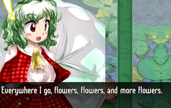

# Tanuki's video recorder

With Tanuki, you can record your Touhou gameplay in the background into a video.

A recording must have a video and audio channel and does not support more than one yet.

Once you configure your recording setup from within the launcher, you can play your game while you record your replay. A video named "tanuki-video.mov" will be saved in your ```output``` path. Tanuki saves its recorder configuration to ```video_config.txt```.

As of now, it is only possible to record your whole screen and not a specific window.

## Supported platforms
* Linux-based systems under x11 and pulseaudio
* Windows
* Any other system under x11 and pulseaudio (untested)

Support for MacOS and other capture backends is on my plans but it is not implemented yet.

Please note that support for Windows capture is experimental. It's implemented but untested.

## Configuration options:

* ```output``` - The path to where you save your video recording.
  * The path must lead to a directory.
* ```delay``` - The delay, in seconds, to when the recording should start after you launch the game.
  * Maximum value is 60 seconds.
* ```vcodec``` - Your video encoder selection and its parameters.
* ```aacodec``` - Your audio encoder selection and its parameters.
* ```vcapture``` - Your screen capture configuration.
* ```acapture``` - Your audio capture configuration.
* ```crop``` - Crop your video footage.
* ```scale``` - Scale your video footage.

The video and audio encoding parameters are unique to each encoder.

## How to properly capture gameplay

Tanuki only captures the whole screen, unable to capture specific windows. Because of this, your video's width and height should correspond to the **display** resolution you will be playing Touhou at. Here's the recommendations:

* Touhou 6 to 13 (fullscreen): 640x480
* Touhou 14 onward (fullscreen): 1280x960
* Game in fullscreen with WINE with fshack: Your screen's resolution.

Fshack is a patch that can be added to Wine that prevents the game's resolution from affecting your display's.

If you are playing with wine+fshack and capturing at your screen's native resolution, you might want to use ```crop``` to remove the reundant 4:3 letterboxing in the video. For example, if you are recording at 1920x1080, you could do ```crop=1440:1080```.

If you are experiencing stuttering or frame drops, your encoding is too heavy. If lowering the encoding configuration isn't enough, you can set a lower capture framerate or use the ```scale``` option to encode at a lower resolution. If you instea use a lower **capture** resolution, you will just be cropping your capture input from the x:y position of 0x0, use scale instead.
 
## Supported encoders

### Video
* x264 (default)
  * H.264, Great all-rounder, supports both lossless and lossy encoding
* x264rgb
  * H.264, Great all-rounder, supports RGB and both lossless and lossy encoding
* qsv
  * H.264, GPU-based encoder, extremely fast, requires an Intel GPU, only supports lossy compression and NV12
* qsv265
  * H.265, GPU-based encoder, really fast encode, very slow decode, requires an Intel GPU, only supports lossy compression
* nvenc
  * H.264, GPU-based encoder, extremely fast, requires an NVIDIA GPU
* mjpeg
  * MJPEG, lossy YUV, great for video editing performance, reasonable file size
* mjpegqsv
  * MJPEG, GPU-based encoder, extremely fast, very fast decode, requires an Intel GPU, lossy compression.
* utvideo
  * Huffman, lossless RGB, great for video editing performance, extremely large files

### Audio
* pcm (default)
  * Uncompressed audio, very fast to encode and decode, great for audio work.
* mp3
  * Lossy audio, great support.
* aac
  * Lossy audio, best support, more efficient than mp3.

## Choosing a video encoder

If you don't know what to choose, x264 is recommended with either pcm or mp3. As for x264, the superfast preset is reasonable in terms of speed and compression quality. Use ultrafast if your CPU can't keep up.

x264rgb is x264 but uses the RGB color format, producing color that is faithful to your game's original image.

QSV encodes in H.264, just like x264, but it's a hardware encoder for Intel GPUs. Encoding speed is extremely fast compared to CPU-based encoders, although it doesn't support RGB or lossless encoding.

Tanuki offers the H.265 variant of QSV. This encoder is the QuickSync implementation for H.265, rather than H.264. Compression efficiency is higher, although encoding speed is a bit slower and decoding speed is noticeably slower, it's not ideal for heavy video editing. Unlike H.264 QSV, this variant supports YUV 4:2:2, which is always better than NV12 for color preservation.

NVENC is also a GPU-based encoder. Tanuki's implementation supports H.264 only. NVENC's concept and performance is very to QSV, but you require an NVIDIA GPU that supports NVENC. NVENC is also capable of better quality than QSV due to supporting RGB and YUV 4:4:4.

Utvideo is a lossless intraframe codec. Encoding speed is somewhere around x264 ultrafast. Utvideo is much faster to decode (good for video editing), although it produces **significantly** large files.

MJPEG is a lossy intraframe encoder that implements JPEG image encoding in video. Encoding speed is probably faster than utvideo and x264 ultrafast. File size is reasonable. Decoding speed is very fast, like utvideo.

QSV also offers a variant for MJPEG. Encoding speed is extremely fast, the fastest of all encoding solutions available here.

As for audio, PCM is uncompressed audio, while mp3 and opus are lossy. If you want a fully faithful audio capture without quality loss, use PCM. If you want wide platform support as well as a lower digital footprint, use mp3 or aac.

### Quick encoding speed comparison
* QSV MJPEG (extremely fast)
* NVENC (extremely fast)
* QSV H.264 (extremely fast)
* QSV H.265 (very fast)
* MJPEG (fast)
* x264 ultrafast (somewhat fast)
* Utvideo (somewhat fast)
* x264 veryfast (slow)
* x264 medium (very slow)

### Quick decoding speed comparison
* MJPEG and QSV MJPEG (extremely fast)
* Utvideo (extremely fast)
* x264, NVENC and QSV H.264 (good enough)
* QSV H.265 (very slow)

Decoding speed only matters for video editing and other video-related workflows as well as playing back the videos on weak hardware or without hardware acceleration.

## Video encoding parameters

### CRF (x264)

CRF is the encoding's control rate factor. It establishes a constant quality target and the bitrate varies throughout the video according to its need for information to produce the wanted quality. Value ranges fom 0 to 51, with 0 being lossless and higher values producing lower quality.

A good value for decent quality with not-so-huge file sizes would be a CRF between 8 and 15.

### Bitrate (QSV and NVENC)

Tanuki sets a constant bitrate for your video encode. It's measured in kilobits per second, and the higher it is, the higher the video quality, at the cost of higher file size.

For QSV, a bitrate between 10000 and 50000 is recommended, but how much you truly need will depend on your recording resolution and framerate.

### Quality (MJPEG)

This sets the quality target for MJPEG encoding. Accepted values range from 1 to 120. The lower the value, the higher the quality, at the cost of a bigger file. 1 produces a very faithful lossy result. Values above 1 are not recommended if you are going to heavily manipulate the video in editing or VFX. Values above 10 are generally not recommended due to the quality result.

### Preset (x264, NVENC and QSV)

The encoding preset sets the encoding parameters that will ultimately define the trade-off between compression quality and speed. A slower preset means that you can get the same video quality for lower file sizes, at the cost of slower encoding that requires more hardware power.

### Color format

The color/pixel format determines how your color information is encoded. For a faithful capture of your gameplay, use rgb24 or an encoder that assumes rgb24, such as x264rgb.

Otherwise, you can use YUV. YUV is able to lower the sampling for color information, while keeping the light information intact. It is useful for lower bitrate demands and file sizes without very noticeable quality loss. YUV 444 has no sampling, 422 and 420 do.

## Audio encoding parameters

### Bit depth

Normally used by PCM in Tanuki, a higher bit depth determines a higher resolution in volume amplitude. Generally, 16bit is fine, but if you are crazy you can always pick 24bit.

### Bitrate

Audio bitrate works the same as video bitrate. Tanuki sets a constant bitrate for your audio encode. It's measured in kilobits per second, and the higher it is, the higher the audio quality, at the cost of higher file size.

## Troubleshooting

### My video is stuttering, the encode is too heavy!

There are many ways to fasten your video encode. The most straightforward ways are to lower your framerate or encoding resolution (by using the scale option).

You might prefer to keep the resolution and framerate as they are. In that case, you can lower the encoding preset (if it exists for your chosen encoder) or switch encoder entirely.

### When recording on Linux with a framerate lower than 60, the video has huge stuttering!

This is a recent issue I discovered when playing Touhou 18 or 19 in fullscreen.

Make sure to enable safe mode when you are configuring the capture options, this will fix it. Note that safemode prevents framerates above 60 as well, though you only have a reason to record at higher than 60 FPS if you raised the game's framerate with vpatch.

<p align="center">

</p>

